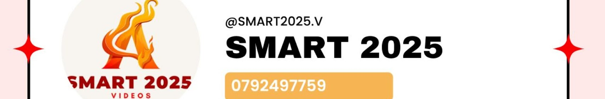

<!DOCTYPE html>
<html lang="en">
<head>
    <meta charset="UTF-8">
    <meta name="viewport" content="width=device-width, initial-scale=1.0">
    <title>SCR tv</title>
</head>
<body style="color: brown;">

     <h1 
     style=
     "color: rebeccapurple;
     font-size: large;
     timeline-scope: inherit;
      front-size: 600px;"
     >
     SMART2025.V
    </h1> 

     <h2 
     style="color: darkolivegreen;">
     Watch Content Every Where
    </h2>  

     

        Irebere Agasobanuye, Amakauru nizindi content 
        kuri Quality yohejuru Mukinyarwanda Kuri SMART2025.V,
         anytime, anywhere.
    

      
     <button style=
     "background-color: cornflowerblue;
     color: aliceblue;
     border: none;
     padding: 20px;
     margin: 20px;"> 
        watch for free!
     </button>
     
</body>
</html>
